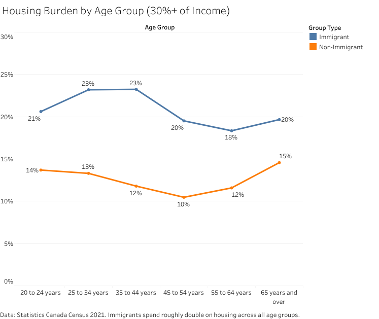

# Housing Affordability Gap: Immigrants vs. Canadian-Born Residents

Immigrants in Canada face significantly elevated housing affordability burdens, 
but the gap is driven less by immigrant status itself than by when they arrived. 
Recent arrivals (2016–2021) spend 30%+ of income on housing at rates of 25.44%. That's nearly 
double the rate of long-settled immigrants (1980–1990: 18.67%) and nearly twice that 
of Canadian-born residents (13.30%). The affordability penalty is sharpest in early 
settlement (first 5 years) and persists across all age groups, suggesting that settlement 
barriers (credential recognition delays, credit access, wage gaps in early years) drive 
outcomes more than immigrant status itself. Once established (10+ years in Canada), 
recent immigrants show similar patterns to longer-settled groups.

*Note: This analysis uses cross-sectional Census 2021 data comparing different arrival 
cohorts at a single point in time, not longitudinal tracking of individuals. The 
observed patterns reflect cohort differences and current snapshots, not documented 
individual trajectories.*

**Research questions:** 
- Do immigrants in Canada face higher housing affordability barriers than Canadian-born residents?
- How much of this gap reflects immigrant status itself vs. time since arrival and settlement barriers (credential recognition, credit access, wage dynamics)?
- What does the arrival-period gradient suggest about settlement context in the Canadian housing and labor markets?
- Are age-related improvements in affordability driven by individual immigrants becoming established, or by different arrival cohorts experiencing different economic conditions?

Questions 2 and 4 guide our interpretation but cannot be fully answered with cross-sectional Census data. We flag them as priorities for future research.

---

## Contents

- [Data Source](#data-source)
- [Key Findings](#key-findings)
  - [Finding 1: The Recency Penalty: Settlement Barriers Outweigh Time in Country](#finding-1-the-recency-penalty-settlement-barriers-outweigh-time-in-country)
  - [Finding 2: Housing Burden Disparities Peak in Mid-Career](#finding-2-housing-burden-disparities-peak-in-mid-career)
  - [Finding 3: A Mid-Career Reprieve: The 45–54 Age Pattern](#finding-3-a-mid-career-reprieve-the-4554-age-pattern)
  - [Finding 4: Extreme Housing Cost Burdens Remain Rare and Stable](#finding-4-extreme-housing-cost-burdens-remain-rare-and-stable)
- [Interpretation](#interpretation)
  - [What the Data Actually Shows](#what-the-data-actually-shows)
  - [Exploring Causes: Ideas for Future Research](#exploring-causes-ideas-for-future-research)
- [What This Analysis Can't Tell Us](#what-this-analysis-cant-tell-us)
- [Recommended Next Steps](#recommended-next-steps)

---

## Data Source

**Where the data comes from:** [Statistics Canada Table 98-10-00245-01](https://www150.statcan.gc.ca/t1/tbl1/en/cv!recreate.action?pid=9810032801&selectedNodeIds=3D2,3D4,3D5,3D6,3D7,4D6,4D12,4D13&checkedLevels=0D1,1D1,2D4,3D5,4D1,5D1,6D3,7D1&refPeriods=20210101,20210101&dimensionLayouts=layout2,layout2,layout3,layout3,layout2,layout2,layout3,layout2,layout2&vectorDisplay=false).

*Note: The 2021 Census is the most recent complete picture we have of this data. The next Census won't be released until 2027–2028.*

**Who was included in the study:** We looked at Canadian households where:

- The household earned money (income greater than $0)
- Housing costs didn't exceed 100% of their income
- People were living in regular private homes (not on reserves or farms)
- This was the 2021 Census, which surveyed 25% of Canadian households

**Geographic and demographic coverage:** The analysis covers all of Canada at the national level, comparing immigrants and Canadian-born residents across age groups (20–64).

*Note: According to the 2021 Census, 53.4% of recent immigrants (2016–2021) settled in Toronto, Montreal, or Vancouver. This national-level analysis likely understates housing affordability challenges in the three cities where the majority of recent arrivals actually live. A regional breakdown by census metropolitan area is needed to reveal whether age-related patterns hold in expensive markets or only in cheaper regions.*

**Necessary data points:** Immigration status, age group, immigration period, shelter-cost-to-income ratio

---

## Key Findings

### Finding 1: The Recency Penalty: Settlement Barriers Outweigh Time in Country

Recent immigrants face a persistent affordability disadvantage that is independent of age—evidence that settlement barriers, not mere recency, drive housing insecurity.

[View interactive visualization on Tableau Public](https://public.tableau.com/views/HousingBurdenbyAgeGroupImmigrantsvs_Non-Immigrants/DashboardHousingBurdenByAgeGroup?:language=en-US&:sid=&:redirect=auth&:display_count=n&:origin=viz_share_link)

To isolate the effect of recency from age, we compare immigrants in the same age group but with vastly different tenure: a 45–54-year-old who arrived 40+ years ago versus a 45–54-year-old who arrived fewer than 5 years ago. The 30%+ shelter cost burden increases sharply with arrival recency and remains elevated across all age groups:

| Age Group | 1980–1990 | Recent (2016–2021) | Burden Gap |
|-----------|-------------------------------|-------------------|------------|
| 25–34 years | 18.67% | 25.44% | +6.77pp |
| 35–44 years | 17.45% | 25.22% | +7.77pp |
| 45–54 years | 16.32% | 25.54% | +9.22pp |
| 55–64 years | 15.76% | 24.48% | +8.72pp |
| 65+ years | 19.93% | 24.16% | +4.23pp |

**What this reveals:** The recency penalty appears consistent across all age groups, suggesting it's driven by years-since-arrival rather than age or career stage. This rules out the explanation that the penalty is purely an age or career-stage artifact. A 45–54-year-old who arrived in 2016 faces 9.2 percentage points higher burden than a 45–54-year-old who arrived before 1980, despite being in the same life stage. The pattern is clear: immigrants face an affordability cliff in their first 5 years, then gradually improve. Someone who arrived in 2016–2021 carries a ~4–9 percentage point penalty regardless of whether they're 25 or 65 today. Notably, the 65+ age group shows a smaller recency gap (4.23 pp compared to 7–9 pp in middle ages), possibly reflecting selection effects (recent arrivals who are now 65+ may be a more established cohort), survivor bias, or changes in family structure and housing support over decades.

**Why this matters:** This finding moves beyond "immigrants struggle" to identify when and why they struggle most: during the critical settlement window. Plausible mechanisms include credential recognition delays specific to Canada's provincial licensing bodies (foreign degrees requiring re-certification or exam fees), limited credit access (new arrivals with no Canadian credit history face higher deposit requirements from lenders), network effects (established immigrants access cheaper housing through community connections), and initial labor market positioning within Canada's job market (new arrivals may accept lower-wage jobs while learning the Canadian labor market and language proficiency requirements, with wages rising as credentials are recognized).

**Caveats:** This pattern likely reflects multiple drivers: time needed for credential recognition and wage growth, but also the economic and policy context at time of arrival. Recent arrivals may face worse affordability partly because they arrived into a tighter housing market with higher prices relative to wages. Disentangling these effects would require tracking individuals over time or comparing arrival cohorts within the same economic period. Neither are possible here.

---

### Finding 2: Housing Burden Disparities Peak in Mid-Career

In 2021, immigrants show elevated housing cost burdens across all age groups compared to non-immigrants, but the relative gap narrows sharply with age. Among those spending 30%+ of income on housing, immigrants are 1.7× more likely at ages 25–34, peaking at 2.0× at ages 35–44, then declining to 1.3× by age 65+.

| Age Group | Immigrants (30%+ burden) | Non-Immigrants (30%+ burden) | Burden Ratio |
|-----------|--------------------------|------------------------------|--------------|
| 20–24     | 20.61%                   | 13.69%                       | 1.5x         |
| 25–34     | 23.19%                   | 13.30%                       | 1.7     |
| 35–44     | 23.24%                   | 11.79%                       | 2.0x  |
| 45–54     | 19.51%                   | 10.48%                       | 1.9x         |
| 55–64     | 18.34%                   | 11.58%                       | 1.6x         |
| 65+       | 19.65%                   | 14.58%                       | 1.3x |

**What this reveals:** Take people aged 25–34. Nearly one in four immigrants (23.19%) spend 30% or more of their paycheck on housing, compared to about one in eight non-immigrants (13.30%). That's 1.7 times higher. At ages 35–44, immigrants are twice as likely (2.0x) to have high housing costs.

### Table 1. Sample Uncertainty: Ages 25–34

| Metric | Count | 95% CI (Count) | Percentage | 95% CI (Percentage) |
|--------|-------|----------------|------------|---------------------|
| Immigrants, 30%+ shelter burden | 247,490 | [242,117–252,963] | 23.19% | [22.69%–23.70%] |
| Non-immigrants, 30%+ shelter burden | 446,325 | [442,928–449,753] | 13.30% | [13.20%–13.40%] |
| Burden Ratio | 1.74x | [1.69–1.80] | 1.74x | [1.69–1.80] |

**Note:** Because this data comes from a sample survey, not a full count, there's some uncertainty around the exact numbers. The numbers in brackets show the range where the true number most likely falls (we can be 95% confident about that). 

#### Supporting Detail: The Affordability Picture (Low-Cost Housing)

The same mid-career squeeze appears when we measure affordability differently—looking at who has housing costs below 15% of income:

| Age Group | Immigrants (<15% burden) | Non-Immigrants (<15% burden) |
|-----------|--------------------------|------------------------------|
| 20–24     | 37.08%                   | 52.46%                       |
| 25–34     | 31.02%                   | 42.54%                       |
| 35–44     | 29.55%                   | 44.62%                       |
| 45–54     | 38.66%                   | 55.17%                       |
| 55–64     | 46.44%                   | 59.69%                       |
| 65+       | 46.56%                   | 56.13%                       |

This shows the pattern holds across multiple metrics, not just one threshold.

---

### Finding 3: A Mid-Career Reprieve: The 45–54 Age Pattern

Within the mid-career struggle, immigrants aged 45–54 show slightly better housing affordability than the 35–44 group (19.51% vs. 23.24% with 30%+ burden). However, because this is cross-sectional data, we're comparing different cohorts, not tracking individual improvement over time. This pattern could reflect income gains, tenure changes (renting to owning), or different economic conditions faced by different arrival cohorts. We can't distinguish these with Census data alone.

| Age Group | Immigrants (30%+ burden) | Non-Immigrants (30%+ burden) | Change from Prior Age Group |
|-----------|--------------------------|------------------------------|----------------------------|
| 25–34     | 23.19%                   | 13.30%                       | —                          |
| 35–44     | 23.24%                   | 11.79%                       | +0.05 pp (immigrant), −1.51 pp (non-immigrant) |
| 45–54     | **19.51%**               | 10.48%                       | **−3.73 pp (immigrant)** ✓, −1.31 pp (non-immigrant) |

---

### Finding 4: Extreme Housing Cost Burdens Remain Rare and Stable

Extreme housing cost burdens (spending 50%+ of income on housing) affect a small but consistent subset of immigrants across all ages. The prevalence among immigrants ranges from 5.7% to 6.6% and shows no systematic worsening pattern with age.

| Age Group | Immigrants (50%+ burden) | Non-Immigrants (50%+ burden) |
|-----------|--------------------------|------------------------------|
| 20–24     | 6.37%                    | 3.80%                        |
| 25–34     | 6.60%                    | 2.97%                        |
| 35–44     | 6.43%                    | 2.74%                        |
| 45–54     | 5.72%                    | 2.83%                        |
| 55–64     | 5.80%                    | 3.41%                        |
| 65+       | 5.78%                    | 3.49%                        |

**What this reveals:** While immigrants are roughly twice as likely as non-immigrants to face extreme housing cost burdens, the prevalence remains relatively low and stable across ages (not rising steeply in mid-career as might be expected). The modest variation (6.60% → 5.72% → 5.78%) could reflect either cohort differences or genuine age-related patterns, but neither interpretation is available from cross-sectional data alone. The absence of escalation is notable: extreme housing stress doesn't accumulate in a worsening trajectory for this population.

**Why this matters:** This finding offers partial reassurance: extreme housing precarity isn't a growing or deepening problem as observed in this snapshot. However, the persistent 2× gap remains important, even at lower prevalence levels. This finding is mixed: the absolute prevalence (5–6%) is reassuringly low, suggesting catastrophic housing costs are not widespread. However, the persistent 2× gap is important. It means a meaningful subset of immigrants faces housing insecurity that non-immigrants rarely experience. Policy should address both the severity (rare but real) and the disparity (consistent 2× burden).

---
## Interpretation

### What the Data Actually Shows

1. **Recent arrivals face a persistent affordability penalty independent of age.** Across all age groups (25–64), immigrants who arrived 2016–2021 spend 6–9 percentage points more of their income on housing than those who arrived 1980–1990. This suggests the barrier is settlement-related (credential recognition, credit access, wage dynamics) rather than age or life stage. Once established (10+ years), recent immigrants show similar patterns to longer-settled groups.
2. **Mid-career immigrants (ages 25–44) face the sharpest burden.** Immigrants aged 25–34 and 35–44 are 1.7–2.0× more likely than non-immigrants to spend 30%+ of income on housing. This gap narrows significantly by age 55+, where immigrants and non-immigrants converge. Caveat: This reflects different cohorts at different ages, not individual trajectories over time.
3. **Extreme housing precarity is rare and stable across ages.** Only 5–6% of immigrants at any age spend 50%+ of income on housing, with no worsening pattern as they age. While immigrants face this extreme burden at roughly twice the rate of non-immigrants, the low absolute prevalence suggests catastrophic housing costs are not a widespread experience.

---

## Exploring Causes: Ideas for Future Research

**Critical caveat:** Because this is cross-sectional data, we observe patterns by age group rather than individual trajectories over time. The younger immigrants today may face different conditions than older immigrants did at that age. The hypotheses below explain what we'd need to test to understand whether observed age patterns reflect individual improvement over time, or reflect different cohorts with different experiences.

The data shows these age-related patterns are real, but we don't yet know whether they reflect individual immigrants improving over their careers, or different arrival cohorts facing different conditions. Below are explanations we could test with the right data.

---

### Does credential recognition explain age-related improvements?

**What we'd expect to see:** If individual immigrants improve over time due to Canada's credential recognition process, immigrant wages should grow faster than non-immigrant wages in years 5–10 after arrival. Provincial licensing bodies (engineering, medicine, teaching) often require re-certification, exams, or additional work experience, creating a wage penalty in the first 5 years that should diminish as credentials are recognized.

**How we'd test it:** Use longitudinal data to compare wage growth for immigrants who arrived 1990–2010 against non-immigrants at the same age. Look specifically at years 1–3, 5–7, and 10–15 after arrival to see if wage acceleration happens when credential recognition typically completes. This would reveal whether individual immigrants experience the improvement we observe in cross-sectional age patterns.

---

### Does moving from renting to owning explain age-related improvements?

**What we'd expect to see:** If housing burden drops because people switch from expensive rentals to owned homes, we'd see immigrants' homeownership rates jump at ages 45–54. In Canada's housing market, this transition is critical: mortgage payments may be similar to rent, but equity builds, and burden calculations differ for owners versus renters.

**How we'd test it:** Compare ownership rates for immigrants and non-immigrants at ages 25–34, 45–54, and 55–64 using Census data. If the 45–54 improvement in affordability coincides with a jump in ownership, we'd have evidence that tenure changes drive the pattern. This would still be cross-sectional but would help rule out whether the pattern reflects ownership changes rather than income gains.

---

### Does return migration hide who's still struggling?

**What we'd expect to see:** Immigrants facing severe housing insecurity in their late 20s and early 30s may have decided to return to their origin countries. If so, the Census only captures 'survivors'—those whose settlement succeeded well enough to stay. The apparent improvement at ages 45–54 could partly reflect that struggling immigrants are no longer in the dataset. To test this: link 2021 Census data to IRCC departure records and compare return rates for immigrants who arrived 2005–2015. Did those facing high housing burden in their first 5 years leave at higher rates than those facing lower burden?

**How we'd test it:** Link the 2021 Census with Immigration, Refugees and Citizenship Canada (IRCC) administrative records to find out how many immigrants who arrived 2005–2015 left Canada by their late 20s and early 30s (via tax records or departures data). Compare return rates for people who faced high housing burden versus low burden. This would directly test whether selection bias explains the pattern. If immigrants facing severe housing insecurity left at higher rates, the Census would only capture survivors, making conditions look better than they were for the full arrival cohort.

---

### Does household size shrinking explain age-related improvements?

**What we'd expect to see:** If immigrants start with larger households (extended family) and shrink as they age, housing burden per person decreases even if absolute costs stay the same.

**How we'd test it:** Compare household sizes for immigrants and non-immigrants at different ages. This would help explain whether burden improvements reflect household changes rather than income gains.

---

## What This Analysis Can't Tell Us

### 1. Whether These Age Patterns Reflect Individual Trajectories

**The core limitation:** This is cross-sectional data. We're comparing different immigrants at different ages in 2021, not following the same person over decades. The 55-year-old immigrants in this data today may have had very different arrival experiences, economic conditions, or selection pressures than the 25-year-old immigrants will face when they reach 55 in the future.

**Why this matters:** We can describe the age-related patterns we observe, but we cannot claim they reflect individual immigrant lifespans. To make that claim, we'd need longitudinal data tracking the same people over 20–30 years.

---

### 2. The Worst-Off Immigrants Are Missing From This Data

This dataset only counts people who spend up to 100% of their income on housing. It excludes people in severe housing crisis (those who can't afford rent, are living with family to save money, or are unhoused).

**Why this matters:** The real housing struggle for young immigrants (ages 25–44) is probably worse than these numbers show. Immigrants who faced severe housing insecurity or decided to leave Canada aren't counted in the Census. The apparent "recovery" we see might partly reflect that struggling immigrants left the dataset (and the country).

---

### 3. Some Groups Have Less Reliable Numbers Than Others

The 2021 Census surveyed 25% of Canadian households. There are far more non-immigrants in Canada than immigrants, so:

- **Non-immigrants aged 25–34:** 3,355,560 people surveyed
- **Immigrants aged 25–34:** 1,067,415 people surveyed

**Why this matters:** When we see a percentage difference between immigrants and non-immigrants, remember that the immigrant numbers are less precise. Differences that look large might be within the margin of error.

---

### 4. Big Cities Might Have Bigger Problems Than This Shows

This analysis looks at all of Canada together. But Toronto, Vancouver, and Montreal are completely different housing markets from smaller cities and rural areas. Immigrants are heavily concentrated in these major cities (over 75% of recent immigrants settle in Toronto, Vancouver, or Montreal).

**Why this matters:** Young immigrants in Toronto and Vancouver probably face much worse housing affordability than the national average suggests. The national pattern we observe may mask severe regional crises. We can't tell whether age-related improvements happen everywhere or only in cheaper regions. A regional breakdown (by census metropolitan area) would reveal whether mid-career improvements hold in expensive markets where most immigrants actually live.

---

### 5. We Know What Patterns Exist But Not Why

The data shows age-related differences in housing affordability, but it doesn't explain the reason.

**Why this matters:** The policy response depends on causation. If immigrants earn less, we need wage policies. If they can't find affordable rentals, we need housing policy. If struggling immigrants leave, we need retention strategies. The hypotheses section above outlines what data we'd need to test each explanation.

---

### 6. Retirement-Age Immigrants Have Different Income Dynamics

At age 65+, immigrants and non-immigrants show similar housing burden rates. But retirement income in Canada has different eligibility rules for immigrants than for Canadian-born citizens. Immigrants need 10 years of Canadian residence to qualify for OAS; those with fewer years receive reduced benefits. Home equity, private pensions, family support, and selection effects (only stable immigrants staying long-term) could all explain 65+ convergence.

**Why this matters:** The patterns at 65+ may not reflect the same mechanisms as ages 25–44. Convergence at retirement age could reflect established immigrants with owned homes and full pensions, or it could reflect that struggling immigrants left earlier. We cannot use 65+ patterns to understand mid-career struggles without understanding Canada's retirement income architecture.

---

## Recommended Next Steps

To determine whether observed age patterns reflect individual immigrant trajectories or reflect different arrival cohorts facing different Canadian economic and policy conditions, we'd need to test the hypotheses above. The key analyses would involve:

1. **Longitudinal wage data** to see if individual immigrants' earnings improve over their careers, particularly around credential recognition milestones (years 5–7 after arrival).

2. **Return migration analysis** (linking Census to IRCC administrative records) to see if selection bias explains the pattern—specifically, whether immigrants facing severe housing insecurity or precarious work left Canada at higher rates.

3. **Regional breakdowns** (by census metropolitan area: Toronto, Vancouver, Montreal, etc.) to see if age-related improvements hold in expensive markets where most immigrants actually live, or only in cheaper regions.

4. **Ownership and tenure tracking** to see if housing burden improvements reflect transitions from renting to owning, or reflect income gains independent of tenure.

5. **Credential recognition timing analysis** to see if wage acceleration aligns with typical timelines for provincial licensing board approvals (varies by profession and province).

---
